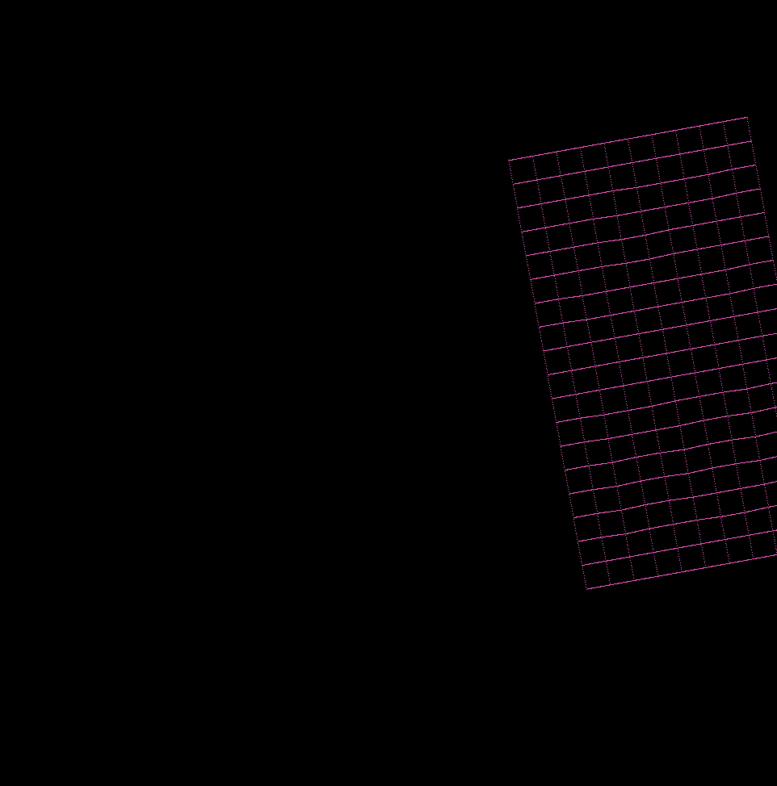

[PROJECT 42 SCHOOL]
=========

(tested on macOS Sierra)

Compile
-----
`make`

Launch
-----

`./fdf maps/10-2.fdf`

Command
-----

- click to move the graph to the cursor's position
- directional arrow : move the graph
- key - : zoom -
- key + : zomm +
- key , : low quality
- key ; : high quality
- key s : rotation x ++
- key z : rotation x --
- key d : rotation y ++
- key q : rotation y --
- key e : rotation z ++
- key a : rotation z --
- key escape : quit
